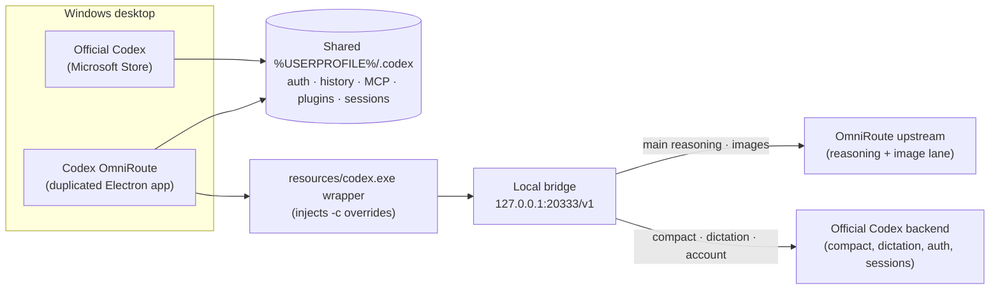

<!--
  Codex OmniRoute — README
  Premium landing page. Technical reference lives in GUIDE.md and
  codex-omniroute-windows-spec.md.
-->

<div align="center">

<a href="#quick-start">
  
</a>

<br />

<h1>Codex OmniRoute</h1>

<p>
  <b>Shared-home gateway для OpenAI Codex Desktop.</b><br />
  Один общий <code>%USERPROFILE%\.codex</code>. Два запуска. Reasoning и image lane уходят через локальный bridge.<br />
  Auth, история, MCP, plugins и connectors остаются на месте.
</p>

<p>
  <a href="#quick-start"></a>
  <a href="#tech-stack"></a>
  <a href="#tech-stack"></a>
  <a href="#tech-stack"></a>
  <a href="#tech-stack"></a>
</p>

<p>
  <a href="#quick-start"></a>
  <a href="#architecture"></a>
  <a href="#configuration"></a>
  <a href="GUIDE.md"></a>
</p>

</div>

<br />

> <samp>**Official Codex stays official.** OmniRoute opens a separate desktop window, routes reasoning through a local bridge, keeps compact and dictation on the official backend, and never copies your auth, history, MCP config or plugins into an isolated profile.</samp>

<br />

---

## Содержание

- [Что это](#что-это)
- [Когда брать](#когда-брать)
- [Key features](#key-features)
- [Quick start](#quick-start)
- [Architecture](#architecture)
- [Route map](#route-map)
- [Tech stack](#tech-stack)
- [Configuration](#configuration)
- [Usage & workflows](#usage--workflows)
- [Project structure](#project-structure)
- [Development & verification](#development--verification)
- [Reliability notes](#reliability-notes)
- [Documentation](#documentation)

<br />

## Что это

Codex OmniRoute — это Windows-шлюз для OpenAI Codex Desktop. Один общий Codex home (`%USERPROFILE%\.codex`) обслуживает оба запуска. Официальный Codex запускается как раньше. Codex OmniRoute открывается отдельным окном и для своего процесса включает overrides, которые перенаправляют main reasoning и image lane на локальный bridge.

<table>
<tr>
<td width="34%" valign="top">
<h4>Один общий home</h4>
<samp>Auth, история чатов, MCP config, plugins, connectors, sessions и model cache остаются в <code>%USERPROFILE%\.codex</code>. OmniRoute не сидит на изолированном профиле.</samp>
</td>
<td width="33%" valign="top">
<h4>Два режима запуска</h4>
<samp>Official Codex — как обычно. Codex OmniRoute — отдельное окно с per-process overrides, которые включают OmniRoute provider только для своего app-server.</samp>
</td>
<td width="33%" valign="top">
<h4>Native tools без поломок</h4>
<samp><code>tool_search</code> и <code>apply_patch</code> остаются Codex-native. Bridge ставит адаптеры там, где upstream не понимает родной протокол.</samp>
</td>
</tr>
</table>

> **Что нужно для работы.** Установленный OpenAI Codex Desktop (Microsoft Store), один вход в аккаунт, Windows 10 или 11. Codex OmniRoute не клонирует Codex и не подменяет его — он рядом.

<br />

## Когда брать

<table>
<tr>
<td width="50%" valign="top">
<h4>Подходит, если</h4>
<ul>
<li>Хочешь маршрутизировать main reasoning через свой OmniRoute / OpenAI-compatible provider.</li>
<li>Используешь image generation/edit через альтернативный gateway.</li>
<li>Нужна возможность переключаться между official и OmniRoute без потери MCP, plugins и истории.</li>
<li>Готов хранить provider key локально, без облачной синхронизации credentials.</li>
</ul>
</td>
<td width="50%" valign="top">
<h4>Не подходит, если</h4>
<ul>
<li>Нет установленного official Codex Desktop с активной учёткой.</li>
<li>Целевая платформа — macOS или Linux. OmniRoute собирается под Windows 10/11.</li>
<li>Нужен production-grade hosted сервис: это локальный bridge, который ты запускаешь на своей машине.</li>
</ul>
</td>
</tr>
</table>

<br />

## Key features

<table>
<tr>
<td width="50%" valign="top">

#### Shared `%USERPROFILE%\.codex`

Никакого копирования `auth.json`, `models_cache.json`, MCP, plugins или sessions в отдельный профиль. Оба окна читают и пишут один и тот же home.

</td>
<td width="50%" valign="top">

#### Per-process provider overrides

OmniRoute provider активируется только через `-c` overrides app-server'а внутри OmniRoute-окна. Глобальный `config.toml` остаётся официальным.

</td>
</tr>
<tr>
<td valign="top">

#### Native `tool_search` rewriting

Bridge ставит upstream-функцию `omniroute_tool_search` и переписывает результаты обратно в Codex-native `tool_search_call` с client execution.

</td>
<td valign="top">

#### Native `apply_patch` adapter

Предпочитается родной freeform-путь. Function-style вызовы от upstream переписываются обратно в Codex-native custom tool call.

</td>
</tr>
<tr>
<td valign="top">

#### OmniRoute image lane

`/v1/images/generations` и `/v1/images/edits` идут через OmniRoute с отдельным `image_api_key`. Имена моделей нормализуются под image gateway.

</td>
<td valign="top">

#### 10MB body budget с inline-image compaction

Свежие inline images остаются в запросе; старые попадают в bounded local media cache и заменяются на text placeholders до отправки upstream.

</td>
</tr>
<tr>
<td valign="top">

#### Compact + dictation остаются official

`/v1/responses/compact`, `/v1/audio/transcriptions` и `/transcribe` не перенаправляются. Account, auth, sessions и connector state — тоже.

</td>
<td valign="top">

#### One-run setup и verifier

`Setup.exe` подбирает зависимости, делает Electron-дубль, ставит ярлыки и запускает `verify-codex-omniroute.ps1` для проверки bridge, MCP и tool adapters.

</td>
</tr>
</table>

<br />

## Quick start

Один прогон от чистой Windows-машины с установленным официальным Codex.

<table>
<tr>
<td width="6%" align="center"><b>1</b></td>
<td>
<b>Поставь OpenAI Codex Desktop.</b><br/>
<samp>Возьми Codex из Microsoft Store, открой один раз и войди в аккаунт.</samp>
</td>
</tr>
<tr>
<td align="center"><b>2</b></td>
<td>
<b>Скачай этот репозиторий.</b>

```powershell
git clone https://github.com/Destruction13/Codex-Omniroute.git
cd .\Codex-Omniroute
```
</td>
</tr>
<tr>
<td align="center"><b>3</b></td>
<td>
<b>Запусти one-run setup.</b>

```powershell
.\Setup.exe
```

<samp>Setup поставит локальные Node.js и .NET SDK при необходимости, подготовит Electron-дубль, спросит OmniRoute base URL и API key, создаст ярлыки и запустит verifier.</samp>
</td>
</tr>
<tr>
<td align="center"><b>4</b></td>
<td>
<b>Запусти Codex OmniRoute.</b><br/>
<samp>Открой ярлык <b>Codex OmniRoute</b> на рабочем столе или в Start Menu. Официальный Codex по-прежнему запускается отдельно через <b>Codex Official</b>.</samp>
</td>
</tr>
</table>

> **SmartScreen.** `Setup.exe` не подписан publisher-сертификатом. При предупреждении SmartScreen выбери **More info → Run anyway**, только если доверяешь этой локальной копии.

<br />

## Architecture

OmniRoute — это локальный bridge на `127.0.0.1:20333/v1`, который Codex OmniRoute-процесс получает через `-c` overrides своего app-server. Общий Codex home сохраняется для обоих окон.



Подробности — в [`codex-omniroute-windows-spec.md`](codex-omniroute-windows-spec.md) и [`GUIDE.md`](GUIDE.md).

<br />

## Route map

Bridge явно разделяет, что уходит в OmniRoute, а что — в официальный backend.

<table>
<tr>
<td width="50%" valign="top">

#### Через OmniRoute

| Endpoint | Назначение |
| --- | --- |
| `/v1/responses` | Main reasoning. Инкремент `main_reasoning_hits`. |
| `/v1/chat/completions` | Compatibility-маршрут. |
| `/v1/images/generations` | Image lane. Использует `image_api_key` при наличии. |
| `/v1/images/edits` | Image edit. JSON + multipart нормализация. |

</td>
<td width="50%" valign="top">

#### Остаётся official

| Endpoint | Назначение |
| --- | --- |
| `/v1/responses/compact` | Compact. Никогда не идёт в OmniRoute. |
| `/v1/audio/transcriptions` | Dictation. |
| `/transcribe` | Dictation upload. |
| `account · auth · sessions · connectors` | Контролируется официальным backend. |

</td>
</tr>
</table>

`/v1/models` отдаётся локально из общего `%USERPROFILE%\.codex\models_cache.json` — без обращения к OmniRoute.

<br />

## Tech stack

<table>
<tr>
<td width="34%" valign="top">

#### Runtime

- Windows 10 / 11
- Node.js 20+ (локально под `%LOCALAPPDATA%\CodexOmniRoute\deps`)
- .NET SDK (локально, для wrapper)
- Electron 42 (дубль official Codex Desktop)

</td>
<td width="33%" valign="top">

#### Launchers

- PowerShell 5+ / PowerShell 7
- `.bat` shims для Start Menu
- `Setup.exe` self-contained bootstrap
- Self-installing local deps

</td>
<td width="33%" valign="top">

#### Bridge & tools

- Node.js bridge (`*.mjs`)
- C# app-server wrapper
- MCP probe + alias proxy
- Bounded local media cache

</td>
</tr>
</table>

<br />

## Configuration

OmniRoute читает конфиг из `omniroute-provider.json` (приоритет) или environment-переменных (см. [`.env.example`](.env.example)).

#### `omniroute-provider.json` (минимальная форма)

```json
{
  "base_url": "https://your-omniroute.example/v1",
  "api_key": "YOUR_OMNIROUTE_KEY",
  "model_prefix": "cx/",
  "default_model": "gpt-5.5",
  "image_api_key": "",
  "image_model": "chatgpt-web/gpt-5.3-instant",
  "model_aliases": {
    "gpt-5.5": "gpt-5.5-xhigh"
  }
}
```

Setup умеет создать файл интерактивно. Вручную — скопируй пример:

```powershell
Copy-Item .\omniroute-provider.example.json .\omniroute-provider.json
```

> `omniroute-provider.json` содержит реальные credentials. Файл занесён в `.gitignore` — не публикуй его.

#### Ключевые env-переменные

| Переменная | Назначение |
| --- | --- |
| `OMNIROUTE_BASE_URL` / `OMNIROUTE_API_KEY` | Альтернатива `omniroute-provider.json`. |
| `OMNIROUTE_MODEL_PREFIX` | Префикс, который применяется к именам моделей (например `cx/`). |
| `OMNIROUTE_MODEL_ALIASES` | JSON-карта алиасов до префиксации. По умолчанию маппит `gpt-5.5` → `gpt-5.5-xhigh`. |
| `CODEX_OMNI_OMNIROUTE_IMAGE_API_KEY` | Отдельный ключ для image lane. Если пуст — используется основной. |
| `CODEX_OMNI_OMNIROUTE_MAX_BODY_BYTES` | Лимит upstream body. По умолчанию `10485760`. |
| `CODEX_OMNI_INLINE_IMAGE_HISTORY_BUDGET_BYTES` | Бюджет на свежие inline images. По умолчанию `6291456`. |
| `CODEX_OFFICIAL_UPSTREAM` | URL official Codex backend для proxy non-OmniRoute трафика. |
| `CODEX_BRIDGE_HOST` / `CODEX_BRIDGE_PORT` | Адрес локального bridge. По умолчанию `127.0.0.1:20333`. |

Полный список и комментарии — в [`.env.example`](.env.example).

<br />

## Usage & workflows

<details>
<summary><b>Запуск, остановка, диагностика</b></summary>

<br />

#### Запустить Codex OmniRoute

```powershell
.\Start-Codex-OmniRoute.ps1
```

#### Открыть конкретный проект в OmniRoute-окне

```powershell
.\Start-Codex-OmniRoute.ps1 -OpenProject C:\AI\Bots\Codex-Omniroute
```

#### Только bridge, без GUI

```powershell
.\Start-Codex-OmniRoute.ps1 -NoCodex
```

#### Запустить официальный Codex

```powershell
.\Start-Codex-Official.ps1
```

#### Остановить OmniRoute-managed helpers (shared home не трогается)

```powershell
.\Start-Codex-OmniRoute.ps1 -Restore
```

#### Проверить bridge health

```powershell
Invoke-RestMethod http://127.0.0.1:20333/healthz
```

Ключевые поля: `codex_home`, `shared_home`, `main_reasoning_hits`, `tool_adapters`, `image_lane`, `body_budget`.

</details>

<details>
<summary><b>MCP и shared config</b></summary>

<br />

MCP-конфигурация остаётся в общем `%USERPROFILE%\.codex\config.toml`. OmniRoute не копирует `[mcp_servers.*]`, `[plugins.*]` или `[marketplaces.*]` в отдельный профиль.

#### Discovery из shared config

```powershell
node .\tools\mcp_probe.mjs --config "$env:USERPROFILE\.codex\config.toml" --json
```

#### Безопасный read-only вызов конкретного сервера (пример: shadcn)

```powershell
node .\tools\mcp_probe.mjs `
  --config "$env:USERPROFILE\.codex\config.toml" `
  --server shadcn `
  --allow-sample-call `
  --call-server shadcn `
  --call-tool get_project_registries `
  --call-args-json '{}' `
  --json
```

</details>

<details>
<summary><b>Что делает setup пошагово</b></summary>

<br />

| Шаг | Результат |
| --- | --- |
| Проверяет официальный Codex | Убеждается, что Desktop app установлен и готов. |
| Ставит локальные зависимости | Node.js и .NET SDK под `%LOCALAPPDATA%\CodexOmniRoute\deps`, если их нет. |
| Запрашивает OmniRoute доступ | Сохраняет base URL и API key в `omniroute-provider.json`. |
| Готовит отдельное окно | Дублирует Codex Desktop в `%LOCALAPPDATA%\CodexOmniRoute\WindowsApp` и собирает app-server wrapper. |
| Создаёт ярлыки | Добавляет **Codex OmniRoute** и **Codex Official** на рабочий стол и в Start Menu. |
| Проверяет запуск | Запускает `verify-codex-omniroute.ps1` и показывает, что bridge, MCP и tool adapters видны. |

</details>

<br />

## Project structure

```text
.
├── Setup.exe / Setup.ps1 / Setup.bat        # One-run bootstrapper
├── Start-Codex-OmniRoute.ps1 / .bat          # OmniRoute launcher
├── Start-Codex-Official.ps1 / .bat           # Official Codex launcher
├── verify-codex-omniroute.ps1                # Gateway, MCP, tool-adapter verifier
├── codex-openai-omniroute-bridge.mjs         # Local bridge (127.0.0.1:20333/v1)
├── bridge-modules/                           # tool-adapters.mjs, media-cache.mjs
├── tools/                                    # mcp_probe, omniroute-catalog,
│                                             # apply_patch-rewriter, wrapper C#, etc.
├── assets/                                   # Hero SVG and visual assets
├── omniroute-provider.example.json           # Provider template
├── default-mcp-catalog.json                  # Empty default catalog
├── .env.example                              # Documented environment variables
├── GUIDE.md                                  # Manual install + diagnostics guide
└── codex-omniroute-windows-spec.md           # Windows shared-home gateway spec
```

<br />

## Development & verification

#### Статические проверки

```powershell
git status --short
node .\tools\check-omniroute.mjs
node --check .\codex-openai-omniroute-bridge.mjs
node --check .\bridge-modules\tool-adapters.mjs
node --check .\bridge-modules\media-cache.mjs
```

`tools\check-omniroute.mjs` запускает `node --check` против всех OmniRoute-модулей и завершается с кодом 1 на первой синтаксической ошибке.

#### Gateway verifier

```powershell
.\verify-codex-omniroute.ps1
.\verify-codex-omniroute.ps1 -ProbeAllMcp
.\verify-codex-omniroute.ps1 -Live
.\verify-codex-omniroute.ps1 -LiveCodexExec
```

Verifier проверяет dependency setup, shared-home bridge health, native tool adapters, image lane, body-budget настройки, безопасный MCP discovery из `%USERPROFILE%\.codex\config.toml` и dry run official launcher.

#### Полная GUI-проверка

Запусти `.\Start-Codex-OmniRoute.ps1`, отправь реальное сообщение в дублированном Codex OmniRoute Desktop окне и убедись, что `/healthz` показывает:

- `main_reasoning_hits > 0`,
- `codex_home` равно `%USERPROFILE%\.codex`,
- `tool_adapters` и `image_lane` инициализированы.

<br />

## Reliability notes

- **Compact и dictation никогда не уходят в OmniRoute.** `/v1/responses/compact`, `/v1/audio/transcriptions` и `/transcribe` зафиксированы на official backend через bridge.
- **Никакого глобального `model_provider="omniroute"`.** Глобальный `config.toml` остаётся официальным; OmniRoute активируется только per-process через `-c` overrides app-server'а.
- **Никакого изолированного home.** Launcher не сидит на `.codex-omniroute-home` и не копирует `auth.json`, `models_cache.json`, MCP config или sessions в отдельный профиль.
- **Никакого user-scope `CODEX_HOME`.** Launcher не пишет user-scope environment в режиме AppX activation — это сломало бы официальный Codex.
- **Bounded media cache.** Старые inline images уходят в локальный media cache c явным лимитом (`CODEX_OMNI_MEDIA_CACHE_MAX_BYTES`); если запрос всё ещё превышает 10MB после compaction, bridge возвращает `413` с диагностикой вместо тихого fallback на official brain.
- **Credentials всегда локально.** `omniroute-provider.json`, `.env` и легаси `.codex-omniroute-home/` зафиксированы в `.gitignore`. OmniRoute не отправляет API key или auth state в облако.
- **`Setup.exe` не подписан.** SmartScreen покажет предупреждение для unsigned binary — стандартное поведение Windows для локально собранных bootstrappers.

<br />

## Documentation

| Документ | Что внутри |
| --- | --- |
| [`GUIDE.md`](GUIDE.md) | Manual install, launch modes, bridge diagnostics, MCP discovery, troubleshooting. |
| [`codex-omniroute-windows-spec.md`](codex-omniroute-windows-spec.md) | Полная спецификация shared-home gateway: canon, launch path, bridge contract, native tools, image lane, verification matrix. |
| [`.env.example`](.env.example) | Все environment-переменные с комментариями. |
| [`omniroute-provider.example.json`](omniroute-provider.example.json) | Шаблон provider-конфига. |

<br />

---

<div align="center">

<samp>Codex OmniRoute is an independent launcher and bridge for OpenAI Codex Desktop on Windows.<br/>
It is not affiliated with, endorsed by, or sponsored by OpenAI. All product names are trademarks of their respective owners.</samp>

</div>
