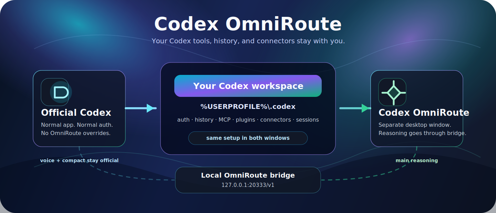
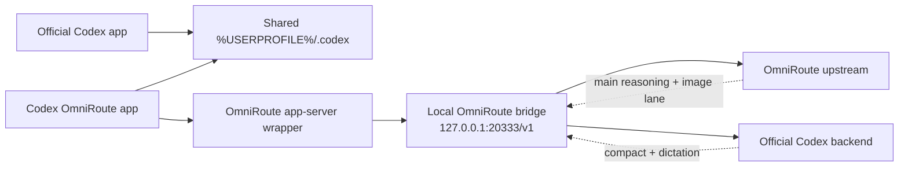

<!--
  Codex OmniRoute README
  Public landing page first, technical reference second.
-->

<div align="center">

<a href="#quick-start">
  
</a>

<h1>Codex OmniRoute</h1>

<p>
  <b>Официальный Codex остаётся официальным.</b><br />
  <b>Codex OmniRoute</b> открывается отдельным окном и гонит reasoning через
  OmniRoute bridge, а твои MCP, плагины, коннекторы и история остаются на месте.
</p>

<p>
  
  
  
  
  
</p>

<p>
  <a href="https://github.com/Destruction13/Codex-Omniroute/archive/refs/heads/main.zip">
    
  </a>
  <a href="#quick-start">
    
  </a>
  <a href="#troubleshooting">
    
  </a>
  <a href="#under-the-hood">
    
  </a>
</p>

</div>

---

<a id="what-this-is"></a>

## Что это

Codex OmniRoute — это Windows-шлюз для Codex Desktop. Он оставляет один
официальный Codex home и меняет только способ запуска окна OmniRoute.

<table>
<tr>
<td width="33%" align="center">
<h3>Один общий Codex home</h3>
<p>
Auth, история чатов, MCP config, plugins, connectors, sessions и model cache
остаются в <code>%USERPROFILE%\.codex</code>.
</p>
</td>
<td width="33%" align="center">
<h3>Два desktop-режима</h3>
<p>
Запускай обычный Codex, когда нужен официальный режим. Запускай Codex
OmniRoute, когда reasoning должен идти через OmniRoute.
</p>
</td>
<td width="33%" align="center">
<h3>Твои tools на месте</h3>
<p>
Всё, что уже настроено в официальном Codex, доступно и в OmniRoute-окне:
MCP, plugins, connectors, sessions и model cache.
</p>
</td>
</tr>
</table>

> **Важно:** Это не клон Codex. Нужен установленный официальный OpenAI Codex
> Desktop, в котором ты уже вошёл в аккаунт.

<a id="quick-start"></a>

## Быстрый старт

Это нормальный путь для свежей Windows-машины, где уже стоит официальный Codex
Desktop.

<table>
<tr>
<td width="8%" align="center"><b>1</b></td>
<td>
<b>Установи официальный OpenAI Codex.</b><br />
Возьми Codex из Microsoft Store, открой его один раз и войди в аккаунт.
</td>
</tr>
<tr>
<td align="center"><b>2</b></td>
<td>
<b>Скачай этот репозиторий.</b><br />
Нажми кнопку сверху или выполни:

```powershell
git clone https://github.com/Destruction13/Codex-Omniroute.git
```
</td>
</tr>
<tr>
<td align="center"><b>3</b></td>
<td>
<b>Запусти setup.</b><br />
Открой PowerShell в папке проекта и выполни:

```powershell
.\Setup.exe
```
</td>
</tr>
<tr>
<td align="center"><b>4</b></td>
<td>
<b>Введи данные доступа.</b><br />
Когда setup спросит, вставь адрес сервиса и ключ доступа. Setup проверит
ключ до перехода к установке и остановит процесс, если верификация не пройдёт.
</td>
</tr>
<tr>
<td align="center"><b>5</b></td>
<td>
<b>Запусти Codex OmniRoute.</b><br />
Используй ярлык на рабочем столе или ярлык в меню Start.
</td>
</tr>
</table>

> **Важно:** `Setup.exe` не подписан publisher-сертификатом. Если Windows
> SmartScreen откроет предупреждение, выбери **More info**, затем
> **Run anyway**, только если доверяешь этой локальной копии.

## Что делает setup

`Setup.exe` нужен, чтобы обычный пользователь не собирал окружение руками. Он
готовит OmniRoute как установленный продукт: зависимости, конфиг, ярлыки и
проверку запуска.

| Шаг | Результат |
| --- | --- |
| Проверяет официальный Codex | Убеждается, что официальный Desktop app установлен и готов. |
| Проверяет ключ доступа | Останавливает setup до установки, если ключ или endpoint не проходят верификацию. |
| Ставит зависимости | Сам ставит локальные Node.js и .NET SDK, если их нет. |
| Спрашивает доступ к сервису | Сохраняет service URL и access key в локальный config. |
| Готовит отдельное окно | Создаёт рабочий запуск **Codex OmniRoute** рядом с официальным Codex. |
| Создаёт ярлыки | Добавляет **Codex OmniRoute** и **Codex Official** на рабочий стол и в Start Menu. |
| Проверяет запуск | Запускает verifier и показывает, что bridge, MCP и tools видны. |

Setup не переключает обычный Codex на OmniRoute. Официальный Codex остаётся
отдельным и запускается как раньше.

## Что нажимать после setup

После установки пользуйся этими входами.

| Что нужно | Что открыть |
| --- | --- |
| Codex с OmniRoute reasoning | **Codex OmniRoute** |
| Обычный официальный Codex | **Codex Official** или обычный ярлык Codex |
| Остановить OmniRoute helpers | `.\Start-Codex-OmniRoute.ps1 -Restore` |
| Проверить установку | `.\verify-codex-omniroute.ps1` |
| Глубоко проверить MCP | `.\verify-codex-omniroute.ps1 -ProbeAllMcp` |

Когда OmniRoute запущен, диагностика bridge доступна здесь:

```text
http://127.0.0.1:20333/healthz
```

Поле `main_reasoning_hits` растёт, когда реальное сообщение из Codex Desktop
доходит до OmniRoute bridge.

## Конфиг провайдера

Setup умеет создать `omniroute-provider.json` интерактивно. Если хочешь
сделать это руками, скопируй пример и заполни свои значения.

```powershell
Copy-Item .\omniroute-provider.example.json .\omniroute-provider.json
```

Минимальная форма:

```json
{
  "base_url": "https://service.example/v1",
  "api_key": "YOUR_OMNIROUTE_KEY",
  "model_prefix": "cx/",
  "default_model": "gpt-5.5",
  "model_aliases": {
    "gpt-5.5": "gpt-5.5-xhigh"
  }
}
```

Не публикуй `omniroute-provider.json`. В нём локальные credentials.

<a id="troubleshooting"></a>

## Если что-то пошло не так

Начни с restore. Он только останавливает OmniRoute-managed helpers и не
удаляет shared Codex home.

```powershell
.\Start-Codex-OmniRoute.ps1 -Restore
```

Частые проблемы:

| Симптом | Что сделать |
| --- | --- |
| Setup пишет, что official Codex missing | Установи OpenAI Codex из Microsoft Store, открой один раз, войди в аккаунт, затем снова запусти `Setup.exe`. |
| Setup просит service URL или access key | Введи выданные данные доступа или заранее создай `omniroute-provider.json`. |
| Один MCP показывает `auth_required` | MCP есть в shared config, но ему нужен свой token или OAuth grant. Настрой его в official Codex home. |
| OmniRoute window открывается, но bridge hits не растут | Открой `http://127.0.0.1:20333/healthz`, проверь `main_reasoning_hits`, затем запусти verifier. |
| Что-то выглядит stale | Запусти `.\Start-Codex-OmniRoute.ps1 -Restore`, затем снова `.\Setup.exe`. |

<a id="under-the-hood"></a>

<details>
<summary><b>Под капотом: routes, native tools, images и architecture</b></summary>

<br />

## Карта маршрутов

Codex OmniRoute сохраняет native Codex behavior там, где это важно, и гонит
через local bridge только OmniRoute lanes.

<table>
<tr>
<td width="50%">
<h3>Идёт через OmniRoute</h3>
<ul>
<li><code>/v1/responses</code></li>
<li><code>/v1/chat/completions</code></li>
<li><code>/v1/images/generations</code></li>
<li><code>/v1/images/edits</code></li>
</ul>
</td>
<td width="50%">
<h3>Остаётся official</h3>
<ul>
<li><code>/v1/responses/compact</code></li>
<li><code>/v1/audio/transcriptions</code></li>
<li><code>/transcribe</code></li>
<li>account, auth, sessions, connector state</li>
</ul>
</td>
</tr>
</table>

`/v1/models` отдаётся из общего `%USERPROFILE%\.codex\models_cache.json`.

## Native tools без поломок

OmniRoute mode сохраняет Codex-native tools. Там, где upstream не понимает
родной протокол Codex, bridge ставит адаптер.

| Tool path | Что происходит |
| --- | --- |
| `tool_search` | Bridge показывает upstream функцию `omniroute_tool_search` и переписывает результат обратно в native `tool_search_call` с client execution. |
| `apply_patch` | Предпочитается native/freeform path. Function-style upstream calls переписываются обратно в Codex-native custom tool calls. |
| MCP servers | Загружаются из настоящего общего `%USERPROFILE%\.codex\config.toml`. |
| Plugins and connectors | Используют официальный shared home и cache. |

## Изображения и проблема 10MB

Image generation и edits могут идти через OmniRoute. Compact и dictation
остаются official.

Некоторые OmniRoute-compatible upstreams отклоняют body больше 10MB. Bridge
оставляет свежие inline images в запросе, складывает старые inline images в
bounded local media cache и заменяет пропущенные изображения text placeholders
перед отправкой.

Основные лимиты:

```text
CODEX_OMNI_OMNIROUTE_MAX_BODY_BYTES=10485760
CODEX_OMNI_INLINE_IMAGE_HISTORY_BUDGET_BYTES=6291456
CODEX_OMNI_MEDIA_CACHE_MAX_BYTES=536870912
```

<a id="architecture"></a>

## Архитектура

Этот раздел нужен, если хочется понять механику. Для обычной установки
достаточно `Setup.exe` и ярлыка **Codex OmniRoute**.



На Windows launcher:

1. Копирует официальный Store app в
   `%LOCALAPPDATA%\CodexOmniRoute\WindowsApp`.
2. Оставляет active `CODEX_HOME` равным `%USERPROFILE%\.codex`.
3. Выносит только OmniRoute Electron UI state в
   `%LOCALAPPDATA%\CodexOmniRoute\ElectronUserData`.
4. Сохраняет official CLI как `resources\codex-official.exe`.
5. Подключает app-server wrapper только внутри OmniRoute-окна.
6. Запускает `codex-official.exe app-server` с process-level `-c` overrides.

Главные overrides:

```powershell
-c 'model_provider="omniroute"'
-c 'model="gpt-5.5"'
-c 'model_reasoning_effort="xhigh"'
-c 'features.tool_search=true'
-c 'features.apply_patch_freeform=true'
-c 'model_providers.omniroute.base_url="http://127.0.0.1:20333/v1"'
-c 'model_providers.omniroute.wire_api="responses"'
-c 'model_providers.omniroute.env_key="OMNIROUTE_API_KEY"'
-c 'model_providers.omniroute.requires_openai_auth=true'
-c 'model_providers.omniroute.supports_websockets=false'
```

Эти overrides существуют только внутри процесса **Codex OmniRoute**. Они не
становятся глобальными настройками official Codex.

## Ручные команды

Это нужно для разработки и диагностики.

```powershell
.\tools\Install-CodexOmniRouteDependencies.ps1
.\Start-Codex-OmniRoute.ps1
.\Start-Codex-OmniRoute.ps1 -NoCodex
.\Start-Codex-Official.ps1
.\verify-codex-omniroute.ps1 -ProbeAllMcp
.\tools\Build-SetupExe.ps1
```

</details>
