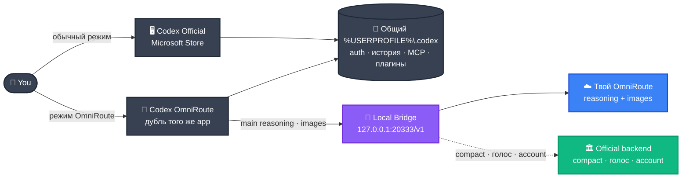

<div align="center">

<!-- ANIMATED HERO BANNER -->
<a href="#-быстрый-старт">
  
</a>

<br />

<!-- ANIMATED TAGLINE -->
<a href="#-что-это">
  
</a>

<br /><br />

<!-- STATUS BADGES -->
<p>
  
  
  
  
  
</p>

<!-- CTA BUTTONS -->
<p>
  <a href="#-быстрый-старт">
    
  </a>
  <a href="#-как-это-работает">
    
  </a>
  <a href="GUIDE.md">
    
  </a>
  <a href="https://github.com/Destruction13/Codex-Omniroute/issues/new?title=OmniRoute+access+request&body=%D0%9F%D1%80%D0%B8%D0%B2%D0%B5%D1%82!+%D0%A5%D0%BE%D1%87%D1%83+%D0%B4%D0%BE%D1%81%D1%82%D1%83%D0%BF+%D0%BA+OmniRoute.+Use+case:+">
    
  </a>
</p>

</div>

<br />

---

## 🧭 Что это

**Codex OmniRoute** даёт тебе официальный **OpenAI Codex Desktop** — но с reasoning через твой OmniRoute-провайдер. Без расхода ChatGPT-квоты. Без потери голоса, Compact, MCP, плагинов и истории чатов.

Один двойной клик в `Setup.exe` — и у тебя на рабочем столе появятся два ярлыка рядом: **Codex Official** (как обычно) и **Codex OmniRoute** (с твоим reasoning).

> [!IMPORTANT]
> Это не клон и не замена Codex. Нужен установленный **OpenAI Codex Desktop из Microsoft Store** с активным входом в аккаунт.

<br />

---

## ✨ Что ты получаешь

<table>
<tr>
<td align="center" width="33%">
  <h3>🪪 Один аккаунт, два режима</h3>
  <p>Auth, история, MCP, плагины и connectors живут в одном <code>%USERPROFILE%\.codex</code>. Переключайся между Official и OmniRoute — без сброса профиля.</p>
</td>
<td align="center" width="33%">
  <h3>🎯 Только reasoning</h3>
  <p>В OmniRoute уходит только основной reasoning и image-пайплайн. Compact, голос, account и connectors — на официальном backend.</p>
</td>
<td align="center" width="33%">
  <h3>🛠 Родные тулы</h3>
  <p><code>tool_search</code> и <code>apply_patch</code> остаются Codex-native — bridge ставит адаптеры под любой upstream.</p>
</td>
</tr>
<tr>
<td align="center">
  <h3>🖼 Image lane</h3>
  <p>Картинки идут через отдельный <code>image_api_key</code>. Большие inline-изображения уходят в локальный кэш и заменяются placeholder'ами.</p>
</td>
<td align="center">
  <h3>⚡ One-click setup</h3>
  <p><code>Setup.exe</code> поставит Node.js и .NET SDK, спросит ключ, создаст ярлыки и запустит верификатор.</p>
</td>
<td align="center">
  <h3>🩺 Self-check</h3>
  <p><code>verify-codex-omniroute.ps1</code> прогоняет полную диагностику: bridge, native tools, MCP, image lane.</p>
</td>
</tr>
</table>

<br />

---

## ⚡ Быстрый старт

> [!TIP]
> Время на установку: примерно **5 минут**. Один поиск в Microsoft Store, один двойной клик, один ключ от провайдера.

<table>
<tr><td><h3>1️⃣ &nbsp; Поставь OpenAI Codex Desktop</h3></td></tr>
<tr><td>

Найди **OpenAI Codex** в Microsoft Store, установи, войди один раз в свой аккаунт. Codex сохранит auth и можно закрывать.

<a href="https://apps.microsoft.com/search?query=openai+codex"></a>

</td></tr>

<tr><td><h3>2️⃣ &nbsp; Скачай этот репозиторий</h3></td></tr>
<tr><td>

**Без git:** нажми зелёную кнопку **Code → Download ZIP** наверху страницы. Распакуй в стабильное место, например `C:\Tools\Codex-Omniroute\`.

**Через git:**

```powershell
git clone https://github.com/Destruction13/Codex-Omniroute.git
```

</td></tr>

<tr><td><h3>3️⃣ &nbsp; Получи OmniRoute-доступ</h3></td></tr>
<tr><td>

Нужны два значения: `base_url` и `api_key`. Они выдаются мейнтейнером — открой issue и опиши кейс.

<a href="https://github.com/Destruction13/Codex-Omniroute/issues/new?title=OmniRoute+access+request&body=%D0%9F%D1%80%D0%B8%D0%B2%D0%B5%D1%82!+%D0%A5%D0%BE%D1%87%D1%83+%D0%B4%D0%BE%D1%81%D1%82%D1%83%D0%BF+%D0%BA+OmniRoute.+Use+case:+"></a>

</td></tr>

<tr><td><h3>4️⃣ &nbsp; Двойной клик на Setup.exe</h3></td></tr>
<tr><td>

В распакованной папке двойной клик на **`Setup.exe`**. Мастер сделает всё сам:

- проверит зависимости, поставит локально Node.js и .NET SDK при необходимости;
- спросит `base_url` и `api_key`, сохранит их в `omniroute-provider.json` (он в `.gitignore`);
- продублирует Codex Desktop как отдельное приложение;
- положит ярлыки **Codex OmniRoute** и **Codex Official** на рабочий стол и в Start Menu;
- прогонит верификатор и покажет статус.

</td></tr>

<tr><td><h3>5️⃣ &nbsp; Пользуйся</h3></td></tr>
<tr><td>

| Что нужно | Что сделать |
|---|---|
| **Codex с OmniRoute reasoning** | Двойной клик на ярлык **Codex OmniRoute** |
| **Обычный Codex** | Двойной клик на ярлык **Codex Official** |
| **Проверить bridge** | `Invoke-RestMethod http://127.0.0.1:20333/healthz` |

Оба режима работают параллельно. OmniRoute не трогает твой обычный профиль.

</td></tr>
</table>

> [!WARNING]
> `Setup.exe` не подписан publisher-сертификатом. Windows SmartScreen покажет предупреждение — это нормальное поведение для локально собранных bootstrapper'ов. **More info → Run anyway** — только если доверяешь этой копии.

<br />

---

## 🏗 Как это работает



<details>
<summary><b>📋 Куда уходит какой запрос?</b></summary>

<br />

| Endpoint | Куда идёт |
|---|---|
| `/v1/responses` | **OmniRoute** — main reasoning |
| `/v1/chat/completions` | **OmniRoute** — compatibility |
| `/v1/images/generations` | **OmniRoute** — image lane (использует `image_api_key`) |
| `/v1/images/edits` | **OmniRoute** — image edit |
| `/v1/responses/compact` | **Official backend** — никогда не идёт в OmniRoute |
| `/v1/audio/transcriptions` | **Official backend** — голосовая диктовка |
| `/v1/models` | **Локально** из `%USERPROFILE%\.codex\models_cache.json` |
| account · auth · sessions · connectors | **Official backend** |

</details>

<br />

---

## 📖 Документация

<table>
<tr>
<td align="center" width="33%">
  <a href="GUIDE.md"></a>
  <p>Ручная установка, режимы запуска, диагностика, MCP discovery, troubleshooting.</p>
</td>
<td align="center" width="33%">
  <a href="codex-omniroute-windows-spec.md"></a>
  <p>Архитектурная спецификация shared-home gateway: bridge contract, image lane, verification matrix.</p>
</td>
<td align="center" width="33%">
  <a href=".env.example"></a>
  <p>Все environment-переменные с комментариями для тонкой настройки.</p>
</td>
</tr>
</table>

<br />

<details>
<summary><b>🔧 Команды и параметры (для тех, кто любит CLI)</b></summary>

<br />

**Запуск из терминала**

```powershell
.\Start-Codex-OmniRoute.ps1
.\Start-Codex-OmniRoute.ps1 -OpenProject C:\AI\MyProject
.\Start-Codex-OmniRoute.ps1 -NoCodex           # только bridge, без GUI
.\Start-Codex-OmniRoute.ps1 -Restore           # остановить OmniRoute helpers
.\Start-Codex-Official.ps1                     # официальный Codex
```

**Диагностика**

```powershell
Invoke-RestMethod http://127.0.0.1:20333/healthz
.\verify-codex-omniroute.ps1
.\verify-codex-omniroute.ps1 -Live             # реальный smoke
.\verify-codex-omniroute.ps1 -ProbeAllMcp      # проверить все MCP
node .\tools\check-omniroute.mjs               # syntax check
```

</details>

<details>
<summary><b>🛡 Что гарантированно не сломается</b></summary>

<br />

- **Compact и голос никогда не уходят в OmniRoute.** `/v1/responses/compact`, `/v1/audio/transcriptions` и `/transcribe` зафиксированы на official backend.
- **Никакого изолированного home.** Auth, история, MCP и plugins не копируются — оба окна работают с общим `%USERPROFILE%\.codex`.
- **Никакого глобального override.** OmniRoute активируется только per-process через `-c` overrides app-server'а внутри OmniRoute-окна.
- **Credentials локально.** `omniroute-provider.json` и `.env` зафиксированы в `.gitignore` — ничего не уходит в облако.
- **Bounded media cache.** Старые inline-изображения уходят в локальный кэш; запрос больше 10 MB после compaction вернёт `413` с диагностикой вместо тихого fallback.

</details>

<br />

---

<div align="center">


<samp>Codex OmniRoute — независимый launcher и bridge для OpenAI Codex Desktop на Windows.<br/>Не аффилирован, не одобрен и не спонсируется OpenAI. Все названия — товарные знаки их владельцев.</samp>

</div>
