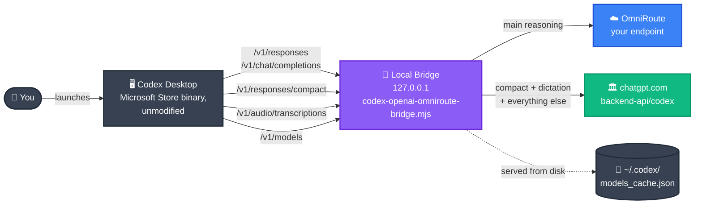

<!--
  Codex OmniRoute — README
  Source files of truth for the technical contract:
    - codex-omniroute-windows-spec.md  (normative spec for re-implementers)
    - GUIDE.md                          (day-to-day operator handbook)
  This file is the public landing page. Keep it scannable.
-->

<div align="center">

<!-- Hero banner (SVG generated on-the-fly by capsule-render.vercel.app) -->
<a href="#-quick-start">
  
</a>

<!-- Animated tagline -->
<a href="#-architecture">
  
</a>

<br />

<!-- Status badges -->
<p>
  
  = 18.18" />
  
  
  
</p>

<!-- Call-to-action buttons -->
<p>
  <a href="https://github.com/Destruction13/Codex-Omniroute/issues/new?title=OmniRoute+access+request&body=Hi%2C+I%27d+like+access+to+OmniRoute.+My+use+case%3A+">
    
  </a>
  <a href="#-quick-start">
    
  </a>
  <a href="#-architecture">
    
  </a>
  <a href="https://github.com/Destruction13/Codex-Omniroute/issues">
    
  </a>
</p>

</div>

---

## What is this

Codex OmniRoute is a **thin reasoning rerouter** around the unmodified Microsoft Store Codex desktop app. It runs the **same official binary** you'd launch from the Start Menu, but the launcher points it at an **isolated `CODEX_HOME` directory** (next to the launcher, on disk) whose `config.toml` reroutes main reasoning through a local OpenAI-compatible bridge that forwards to your OmniRoute endpoint instead of the OpenAI account behind your Codex login. Your real `~/.codex/` directory is **never modified** — the isolated home is seeded from a copy of it on every launch (so Codex Desktop stays signed in as you) and `Start-Codex-OmniRoute.ps1 -Restore` simply deletes the isolated directory.

What you get out of it:

- **Codex stays Codex.** Voice Dictation, Compact, Skills, MCP servers, plugins, and future Store updates keep working. The Store package is never modified.
- **Zero account quota spent.** All reasoning calls leave through your OmniRoute key.
- **Both modes coexist.** Switch between OmniRoute mode and vanilla mode with a different `.bat` — no reinstall, no profile reset.

> [!IMPORTANT]
> This is **not** a Codex clone or a Codex replacement. It cannot work without the official Microsoft Store Codex app installed and signed in.

---

## ✨ Highlights

<table>
<tr>
<td align="center" width="33%">
<h3>🎯 Targeted</h3>
<p>Only <code>/v1/responses</code> and <code>/v1/chat/completions</code> are rerouted. Compact, dictation, models list, and everything else still hits the official upstream.</p>
</td>
<td align="center" width="33%">
<h3>🔀 Reversible</h3>
<p>OmniRoute mode runs Codex against an isolated <code>.codex-omniroute-home/</code> next to the launcher; your real <code>~/.codex/</code> is never touched. <code>-Restore</code> deletes the isolated dir. <code>Start-Codex-Official.ps1</code> just stops the bridge. Codex still sees your real Windows profile, so file dialogs, <code>git</code>, and projects all work normally.</p>
</td>
<td align="center" width="33%">
<h3>⚡ One-click setup</h3>
<p><code>Setup.bat</code> verifies prerequisites, asks for your <code>base_url</code> + <code>api_key</code>, writes the gitignored config, runs a smoke test. Idempotent — safe to re-run.</p>
</td>
</tr>
<tr>
<td align="center">
<h3>🛡 Native behavior</h3>
<p>Codex is activated via the AppX broker (same path the Start Menu takes), so <code>apply_patch.bat</code>, <code>rg</code>, MCP servers, file dialogs, and <code>git</code> all keep working out of the box. The managed block enables <code>experimental_use_freeform_apply_patch</code> as an extra safety net.</p>
</td>
<td align="center">
<h3>🔍 Verifiable</h3>
<p><code>verify-codex-omniroute.ps1</code> checks bridge health, isolated <code>CODEX_HOME</code> seeding, real <code>~/.codex</code> stays untouched, and the <code>-Restore</code> round-trip. <code>/healthz</code> exposes <code>main_reasoning_hits</code> + <code>desktop_codex_home_honored</code>. Optional <code>-Live</code> exercises real OmniRoute.</p>
</td>
<td align="center">
<h3>📦 Zero deps</h3>
<p>The bridge is pure Node 18+ stdlib. No <code>npm install</code> required for normal operation. <code>zstd</code> support is opt-in via dynamic import only if you actually receive zstd-encoded bodies.</p>
</td>
</tr>
</table>

---

## ⚡ Quick start

> [!TIP]
> Total time: about **7 minutes**. Five double-clicks plus one Microsoft Store search and one message to the maintainer.

<table>
<tr><td><h3>1️⃣ &nbsp; Install Codex from the Microsoft Store</h3></td></tr>
<tr><td>

Search for <b>OpenAI Codex</b> in Microsoft Store, install it, sign in once, open the app, then close it. This populates `auth.json` and `models_cache.json` under your user profile so the wizard has something to seed from later.

<a href="https://apps.microsoft.com/search?query=openai+codex"></a>

</td></tr>

<tr><td><h3>2️⃣ &nbsp; Install Node.js (LTS)</h3></td></tr>
<tr><td>

Run the LTS installer with default options. The bridge needs Node `>= 18.18`.

<a href="https://nodejs.org/"></a>

</td></tr>

<tr><td><h3>3️⃣ &nbsp; Get the repo onto your machine</h3></td></tr>
<tr><td>

**No git required:** click the green **Code** button on this page → **Download ZIP**, then unzip somewhere stable like `C:\Tools\Codex-Omniroute\`.

**With git:**
```powershell
git clone https://github.com/Destruction13/Codex-Omniroute.git
```

</td></tr>

<tr><td><h3>4️⃣ &nbsp; Get OmniRoute access from the maintainer</h3></td></tr>
<tr><td>

You need two values: a `base_url` and an `api_key`. They are issued out-of-band by the repo maintainer — see [Where to get OmniRoute access](#-where-to-get-omniroute-access) below.

<a href="https://github.com/Destruction13/Codex-Omniroute/issues/new?title=OmniRoute+access+request&body=Hi%2C+I%27d+like+access+to+OmniRoute.+My+use+case%3A+"></a>

</td></tr>

<tr><td><h3>5️⃣ &nbsp; Run the setup wizard</h3></td></tr>
<tr><td>

In the unzipped repo folder, **double-click `Setup.bat`**. The wizard:

1. Verifies that Codex (Microsoft Store) and Node.js (`>= 18.18`) are installed. If anything is missing, it prints a direct download link.
2. Asks for your OmniRoute `base_url` (echoes to the terminal) and `api_key` (input is hidden). **Those are the only two questions.**
3. Writes `omniroute-provider.json` (already in `.gitignore`) with sane defaults for everything else (`model_prefix = "cx/"`, `default_model = "gpt-5.4"`, `gpt55_pin.enabled = false`). If you ever need to tweak those advanced fields, edit the JSON file by hand.
4. Runs `verify-codex-omniroute.ps1 -NoCodex` and prints a `PASS`/`FAIL` table.

If the table ends with `OK Verifier passed`, you're done. Even if the verifier reports `WARN`/`FAIL`, the config has been written and you can proceed to `Start-Codex-OmniRoute.bat`.

</td></tr>

<tr><td><h3>6️⃣ &nbsp; Use Codex with OmniRoute</h3></td></tr>
<tr><td>

| Action | What to do |
|---|---|
| **Codex with OmniRoute reasoning** | Double-click `Start-Codex-OmniRoute.bat` |
| **Vanilla Codex (your normal account)** | Double-click `Start-Codex-Official.bat` |
| **Watch traffic** | `Get-Content .\bridge.log -Tail 50 -Wait` in PowerShell |
| **Confirm bridge actually saw traffic** | `curl http://127.0.0.1:20333/healthz` — check `main_reasoning_hits > 0` and `desktop_codex_home_honored: true` |

Both modes can be invoked at any time. OmniRoute mode seeds an isolated `.codex-omniroute-home/` next to the launcher (with a copy of your real `~/.codex/auth.json`, a fresh `config.toml` selecting the bridge, and your `models_cache.json` if present); `Start-Codex-Official.ps1` just stops the bridge and launches Codex; `Start-Codex-OmniRoute.ps1 -Restore` removes the isolated dir.

</td></tr>
</table>

> [!NOTE]
> If something goes wrong on first run, the [GUIDE.md "When something goes wrong"](GUIDE.md#when-something-goes-wrong) table covers the common failure modes (`Get-AppxPackage returned nothing`, `models_cache_missing`, `omniroute_not_configured`, etc.) with one-line fixes.

---

## 🔑 Where to get OmniRoute access

This repo is the **client side** of OmniRoute. The OmniRoute server itself — the actual reasoning provider that the bridge talks to — is operated by the repo maintainer. Access is issued on request.

To get a working `base_url` + `api_key`:

<table>
<tr>
<td align="center" width="50%">
<h3>📨 Open an issue</h3>
<p>Public, easy to track, works for everyone.</p>
<a href="https://github.com/Destruction13/Codex-Omniroute/issues/new?title=OmniRoute+access+request&body=Hi%2C+I%27d+like+access+to+OmniRoute.+My+use+case%3A+"></a>
</td>
<td align="center" width="50%">
<h3>👤 Contact the maintainer</h3>
<p>For private use cases or follow-up questions.</p>
<a href="https://github.com/Destruction13"></a>
</td>
</tr>
</table>

You'll receive two values:

1. **`base_url`** — looks like `http://127.0.0.1:20128/v1` (if you'll tunnel via SSH; instructions delivered with credentials) or a direct `https://...` endpoint.
2. **`api_key`** — an opaque token. **Treat it like a password.** Don't paste it into chats. Don't commit it. Don't email it in plaintext.

Drop both into `Setup.bat` when prompted. They land in `omniroute-provider.json`, which `.gitignore` excludes.

> [!WARNING]
> Never commit `omniroute-provider.json`, `.env`, or `auth.json`. The `.gitignore` already excludes them, but check `git status` before pushing if you've been editing config by hand.

---

## 🏗 Architecture



The launcher (`Start-Codex-OmniRoute.ps1`) seeds an isolated `CODEX_HOME` directory — `.codex-omniroute-home/` next to the launcher — on every boot:

- `auth.json` is **copied verbatim from your real `~/.codex/auth.json`**. Codex Desktop stays signed in as you; fast mode + ChatGPT credits keep working.
- `models_cache.json` is copied if present.
- `config.toml` is written from scratch with this content:

  ```toml
  model_provider = "omniroute_bridge"
  model = "gpt-5.4"
  profile = "omniroute_managed"
  experimental_use_freeform_apply_patch = true

  [model_providers.omniroute_bridge]
  base_url = "http://127.0.0.1:<bridge_port>/v1"
  wire_api = "responses"
  requires_openai_auth = true
  supports_websockets = false

  [profiles.omniroute_managed]
  model_provider = "omniroute_bridge"
  model = "gpt-5.4"
  model_reasoning_effort = "xhigh"
  ```

- `state_5.sqlite` is **deliberately absent**. Codex Desktop boots with an empty thread store, so the first new-thread create reads `model_provider` straight from the fresh `config.toml`.
- A `.omniroute-seed.json` stamp records what was seeded; the bridge uses it to compute `desktop_codex_home_honored` on `/healthz`.

The launcher then sets the `CODEX_HOME` environment variable to that isolated path and **only that**. `USERPROFILE`, `APPDATA`, `HOME`, `TEMP` are NOT overridden — so `apply_patch.bat`, MCP servers, `git`, `rg`, file dialogs, and projects all run against your real Windows profile.

Codex Desktop is launched via the AppX broker (`IApplicationActivationManager`), the same way the Start Menu does. The package keeps its identity, can call into `WindowsApps\...\app\apply_patch.bat` without Access Denied, and sends its main reasoning to `127.0.0.1:<bridge_port>`, where the bridge forwards to OmniRoute. Everything else (Compact, Dictation, Skills, MCP, plugins, account telemetry) reaches the official Codex backend unchanged — the bridge reads the OAuth bearer Codex Desktop sends on its requests and proxies them straight through.

When you want vanilla Codex back, run `Start-Codex-OmniRoute.ps1 -Restore` (deletes the isolated dir + stops bridge) or just launch `Start-Codex-Official.ps1` (stops the bridge and activates the unmodified Codex package against your real `~/.codex/`). Either way your real `~/.codex/` is untouched.

<details>
<summary><b>📋 Bridge route surface (click to expand)</b></summary>

| Route | Method | Where it goes | Notes |
|---|---|---|---|
| `/healthz` | GET | local | Status JSON: port, pid, omniroute config presence, isolated-home seed stamp, `main_reasoning_hits`, `desktop_codex_home_honored` |
| `/v1/models` | GET | isolated `CODEX_HOME/models_cache.json` | **Never** fetched from OmniRoute |
| `/v1/responses` | POST | OmniRoute | Main reasoning. Model normalized (`gpt-5.4` → `cx/gpt-5.4`), `store=false`, optional GPT-5.5 connection-ID pin. Increments `main_reasoning_hits`. |
| `/v1/chat/completions` | POST | OmniRoute | Same normalization; same counter |
| `/v1/responses/compact` | POST | official upstream | Compact behavior; passes the inbound OAuth bearer straight through to chatgpt.com |
| `/v1/audio/transcriptions` | POST | official upstream | Voice Dictation; `x-codex-base64: 1` envelopes decoded locally |
| `/transcribe` | POST | official upstream `/audio/transcriptions` | Same base64 handling |
| `/v1/images/generations` | GET/POST | official upstream | Optional parity |
| anything else | * | official upstream | Catchall preserves account/MCP/skills/plugins backend calls |

</details>

<details>
<summary><b>🔬 Architecture truth & core invariants (click to expand)</b></summary>

### What changes vs vanilla Codex

| Concern | Behavior |
|---|---|
| Codex UI / Voice Dictation / Skills / MCP / plugins / updates | **Official Microsoft Store app, untouched.** Launched via the AppX broker (`IApplicationActivationManager`), exactly like the Start Menu does. |
| Desktop identity / window separation | **None.** Codex keeps its normal package identity and runs against your normal Windows profile. |
| File dialogs, `git`, SSH, projects | **Your real `%USERPROFILE%`.** No env-var overrides on `USERPROFILE`, `APPDATA`, `HOME`, or `TEMP`. Only `CODEX_HOME` is set, and it only affects Codex Desktop's config/state directory. |
| `~/.codex/config.toml` | **Never modified.** OmniRoute mode writes its config into an isolated `.codex-omniroute-home/config.toml` next to the launcher. |
| `~/.codex/auth.json` | **Never modified.** The launcher copies it (verbatim) into the isolated home so Codex Desktop stays signed in as you. |
| Main reasoning (`/v1/responses`, `/v1/chat/completions`) | **Bridge → OmniRoute** with model normalization, `store=false`, optional GPT-5.5 connection-ID pin. |
| Compact (`/v1/responses/compact`) | **Bridge → official upstream**, forwarding the real OAuth bearer Codex Desktop sends on its requests. |
| Dictation (`/v1/audio/transcriptions`, `/transcribe`) | **Bridge → official upstream**, including base64 multipart envelopes tagged with `x-codex-base64: 1`. |
| Models list (`/v1/models`) | **Served from the isolated `CODEX_HOME/models_cache.json`** (copied from your real `~/.codex/models_cache.json` at seed time) — never fetched from OmniRoute. |
| MCP definitions, marketplaces, plugins | **Inherited from the isolated `config.toml`** if you customized it; out of the box the isolated config only contains the `omniroute_bridge` provider + freeform-apply-patch toggle. |
| `git`, `node`, `npx`, etc. | **User's real binaries.** No git shim, no `PATH` override. |
| `apply_patch.bat` | **Codex's real one in the AppX package.** Works because Codex is activated as a package, not via direct `CreateProcess` against `WindowsApps\...\Codex.exe`. |

### Core invariants (each enforced by the launchers and asserted by the verifier)

1. The Codex executable launched is the unmodified package resolved from `Get-AppxPackage OpenAI.Codex`; no install path is hardcoded.
2. Codex is activated via `IApplicationActivationManager.ActivateApplication` (the AppX broker), exactly like the Start Menu does — not via `Start-Process` against `WindowsApps\...\Codex.exe`. This preserves package identity and prevents Access-Denied on package-internal tools like `apply_patch.bat`.
3. **Official mode** (`Start-Codex-Official.ps1`) inherits the user's environment unchanged. It sets *no* `CODEX_*` / `OMNIROUTE_*` env vars and starts *no* helper processes. Before activating Codex it stops a running managed bridge and — if a previous repo version left them behind — sweeps up the legacy managed-block / sentinel-`auth.json` / `*.codex-omniroute-backup` artifacts in `~/.codex/`.
4. **OmniRoute mode** (`Start-Codex-OmniRoute.ps1`) inherits the user's environment unchanged except for `CODEX_HOME`, which is set to `.codex-omniroute-home/` next to the launcher. The only side-effects on disk are: (a) the isolated `.codex-omniroute-home/` directory (config.toml + auth.json + optional models_cache.json + seed stamp), (b) a managed `node` bridge process tracked by `bridge.pid` next to the launcher, (c) one-shot legacy cleanup in the user's real `~/.codex/` for users upgrading from earlier repo versions. The user's real `~/.codex/config.toml` and `~/.codex/auth.json` are never written to in steady state.
5. The isolated `config.toml` selects `model_provider = "omniroute_bridge"` and `[model_providers.omniroute_bridge]` with `base_url = "http://127.0.0.1:<bridge_port>/v1"`, `wire_api = "responses"`, `requires_openai_auth = true`, `supports_websockets = false`. `state_5.sqlite` is deliberately absent from the isolated home so Codex Desktop reads the fresh `config.toml` on the first new-thread create.
6. `Start-Codex-OmniRoute.ps1 -Restore` (and `Start-Codex-Official.ps1`) stop the bridge, remove the isolated `.codex-omniroute-home/` (where applicable), and sweep up any legacy backup artifacts. The user's real `~/.codex/` is left untouched in steady state.
7. The bridge binds to `127.0.0.1` only.
8. The managed `omniroute_bridge` provider pins `requires_openai_auth = true`, `supports_websockets = false`, `wire_api = "responses"`.
9. Main reasoning goes to OmniRoute; compact + transcription go to the official upstream.
10. `/v1/models` is served from the isolated `CODEX_HOME/models_cache.json` (copied from the user's real cache at seed time), not OmniRoute.
11. The bridge decodes gzip / deflate / brotli / (zstd if a decoder is installed) request bodies and `x-codex-base64: 1` multipart envelopes.
12. Model identifiers like `gpt-5.4` are normalized to `cx/gpt-5.4` (prefix is configurable) before forwarding.
13. No connection IDs, account IDs, or API keys are hardcoded; everything sensitive comes from env, `omniroute-provider.json` (gitignored), or an OpenCode-style provider config.
14. The bridge `/healthz` exposes `main_reasoning_hits` (counter of requests rerouted to OmniRoute since boot) and `desktop_codex_home_honored` (true once Codex Desktop has measurably touched the isolated home — e.g. created `state_5.sqlite`). One `curl` after sending a chat message confirms the bridge is on the main-reasoning path.
15. `verify-codex-omniroute.ps1` exercises all of the above, including the `-Restore` round-trip, without leaving the user's real `~/.codex/` modified.

</details>

---

## ✅ Verify

After setup, you can re-run the verifier any time:

```powershell
.\verify-codex-omniroute.ps1
```

It runs `Start-Codex-OmniRoute.ps1 -NoCodex` (bridge only, no Codex GUI), checks the small set of invariants above (managed block present, bridge `/healthz` responding, backup file exists, official launcher resolves package cleanly, `-Restore` round-trip works), prints a `PASS` / `WARN` / `FAIL` table, and leaves the user's config in its original state. Optional `-Live` flag exercises real OmniRoute `/v1/responses`:

```powershell
.\verify-codex-omniroute.ps1 -Live
```

> [!NOTE]
> The `bridge-models` row may show `WARN` on a fresh install — it goes `PASS` after Codex Desktop has been opened at least once so it can populate `~/.codex/models_cache.json` from `chatgpt.com`.

---

## 🛠 Day-to-day usage

For deeper operational notes — switching modes, resetting the runtime, tunneling OmniRoute, GPT-5.5 pinning, MCP debugging, choosing which account to seed, troubleshooting `apply_patch` failures — see <a href="GUIDE.md"><b>GUIDE.md</b></a>.

For the normative implementation contract (what every component must do, what it must never do, how to re-implement it from scratch), see <a href="codex-omniroute-windows-spec.md"><b>codex-omniroute-windows-spec.md</b></a>.

---

## 🔬 Advanced

<details>
<summary><b>📂 File plan</b></summary>

```
codex-omniroute/
├── README.md                            # this file (public landing page)
├── GUIDE.md                             # day-to-day operator handbook
├── codex-omniroute-windows-spec.md      # normative contract for re-implementers
├── Setup.bat                            # ★ first-time wizard (double-click this)
├── Setup.ps1                            # the wizard logic
├── Start-Codex-Official.ps1             # clean baseline launcher (stops bridge + legacy cleanup)
├── Start-Codex-OmniRoute.ps1            # seeds isolated CODEX_HOME + starts bridge + AppX-activates Codex
├── Start-Codex-Official.bat             # convenience wrapper (double-clickable)
├── Start-Codex-OmniRoute.bat            # convenience wrapper (double-clickable)
├── codex-openai-omniroute-bridge.mjs    # local OpenAI-compatible bridge
├── verify-codex-omniroute.ps1           # invariant checker + optional live smoke
├── omniroute-provider.example.json      # template; Setup.bat creates omniroute-provider.json from this
├── .env.example                         # env vars the bridge understands (alternative to JSON)
├── .gitignore                           # excludes secrets, logs, pid, isolated home dir
├── package.json                         # node engines + scripts (no runtime deps)
├── mock-transcribe-upstream.mjs         # offline test target for /transcribe
├── .codex-omniroute-home/               # ⚡ created at launch (isolated CODEX_HOME, gitignored)
│   ├── config.toml                       # selects model_provider = "omniroute_bridge"
│   ├── auth.json                         # copy of real ~/.codex/auth.json (OAuth tokens intact)
│   ├── models_cache.json                 # copy of real ~/.codex/models_cache.json (if present)
│   └── .omniroute-seed.json              # bridge uses this to compute desktop_codex_home_honored
└── tools/
    ├── mcp_probe.mjs                    # per-server JSON-RPC initialize probe (optional diagnostics)
    └── mcp-stdio-shield.mjs             # optional stdio filter for misbehaving MCP children
```

</details>

<details>
<summary><b>🧰 Manual setup (advanced — skip if you ran <code>Setup.bat</code>)</b></summary>

This section is for users who want to bypass the wizard and configure the provider by hand.

1. Install the official **Codex** app from the Microsoft Store. Sign in normally.
2. `git clone` this repo into your project workspace.
3. Configure the OmniRoute provider — pick one:

   **Environment variables (highest priority):**
   ```powershell
   $env:OMNIROUTE_BASE_URL = "http://127.0.0.1:20128/v1"   # or your remote
   $env:OMNIROUTE_API_KEY  = "<your-omniroute-key>"
   ```

   **Local provider JSON:**
   ```powershell
   Copy-Item .\omniroute-provider.example.json .\omniroute-provider.json
   # edit omniroute-provider.json (it's gitignored)
   ```

   **OpenCode-style** `~/.config/opencode/auth.json` with a provider entry named `cloud_omni`, `miracloud`, or `omniroute`.

4. Optional: if you tunnel OmniRoute, run the SSH tunnel separately:
   ```powershell
   ssh -L 20128:127.0.0.1:<remote_port> -L 1455:127.0.0.1:1455 <your-user>@<your-host>
   ```
   The repo never includes the tunnel command or its credentials.

The launchers work on both Windows PowerShell 5.1 (the default `powershell.exe`) and PowerShell 7+ (`pwsh.exe`). PowerShell 7+ is **recommended but not required** — the `.bat` shims auto-prefer `pwsh.exe` when it's on `PATH` and fall back to `powershell.exe` otherwise. `Setup.bat` will offer to install PowerShell 7+ via `winget` if it's missing, and continues with the built-in PowerShell if you decline.

</details>

<details>
<summary><b>🔐 Things that must remain parameterized or redacted</b></summary>

| Value | Source of truth | Notes |
|---|---|---|
| OmniRoute API key | `OMNIROUTE_API_KEY` env or `api_key` in `omniroute-provider.json` | Gitignored |
| OmniRoute base URL | Same as above | Gitignored if private |
| GPT-5.5 connection ID | `OMNIROUTE_55_CONNECTION_ID` or `gpt55_pin.connection_id` | Opt-in only |
| Codex `auth.json` | `%USERPROFILE%\.codex\auth.json` | Gitignored. The launcher copies it (verbatim) into the isolated `CODEX_HOME` at seed time; the bridge reads the isolated copy for compact/dictation auth fallback. |
| `models_cache.json` / `installation_id` | `%USERPROFILE%\.codex\` | Maintained by Codex itself; the launcher copies `models_cache.json` into the isolated `CODEX_HOME` at seed time; the bridge serves the isolated copy to `GET /v1/models`. |
| MCP server definitions | Inherited from user's official `config.toml` | Whatever the user has |
| SSH tunnel host / user / password | Nowhere in this repo | Rotate if leaked |

The bridge **never** logs `Authorization` headers, API keys, tokens, account IDs, connection IDs, cookies, or `auth.json` contents.

</details>

<details>
<summary><b>🪟 What still requires a real Windows machine or real credentials</b></summary>

The repo is implementable on Linux but **not fully exercisable** without:

- A Windows machine with the **Microsoft Store Codex app** installed and signed in.
- A reachable **OmniRoute** endpoint and API key for live `/v1/responses` smoke.
- A **real `auth.json`** under `%USERPROFILE%\.codex\` for the `auth.json` / `account_id` fallback paths and for live Compact / Dictation smoke.

Without these, `Start-Codex-Official.ps1`, `Start-Codex-OmniRoute.ps1`, and `verify-codex-omniroute.ps1` surface clear errors (`Get-AppxPackage` returning nothing, `models_cache.json` missing, `omniroute_not_configured`).

</details>

---

## 📜 License & contact

<table>
<tr>
<td width="50%">
<h3>License</h3>
<p>This repository is private/unpublished — no license is granted for redistribution. If you obtained access, use it for the agreed-upon scope.</p>
</td>
<td width="50%">
<h3>Contact</h3>
<p>Questions, access requests, bug reports → <a href="https://github.com/Destruction13/Codex-Omniroute/issues">open an issue</a> or contact <a href="https://github.com/Destruction13"><b>@Destruction13</b></a>.</p>
</td>
</tr>
</table>

<div align="center">


<sub>If you're reading this and Codex still feels broken, run <code>.\verify-codex-omniroute.ps1</code> — the first <code>FAIL</code> row tells you what's wrong.</sub>

</div>
